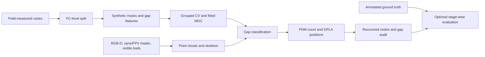

# Morphometry-guided kiwifruit node recovery

This repository runs the field-data masking/classifier workflow, prepares a
single-cane RGB-D reconstruction from supplied masks and visible-bud locations,
recovers undetected nodes, and optionally evaluates them against annotated
ground truth. `NodeRecovery.py` connects the scripts in `methods/` without
requiring users to edit case-specific paths in each script.

The repository contains code only. Field measurements, RGB-D acquisitions,
manual masks, ground truth, and trained YOLO/MGC weights are **not** included.



## 1. Install

Use Python 3.10 in a fresh environment (the pinned dependencies were verified
against a Windows Python 3.10 environment):

```powershell
py -3.10 -m venv .venv
.venv\Scripts\python -m pip install -r requirements.txt
```

The code also runs on other operating systems if the pinned Open3D and
Ultralytics wheels are available. The methods use metres for point clouds and
arc coordinates, millimetres for reported diameter/localisation errors, and
centimetres for the original field-data columns.

## 2. Supply the manual inputs

Copy `config.example.json` to `config.json`, then edit the paths and camera
calibration. Paths may be absolute or relative to `config.json`.

For classifier training, `field_data` must be an Excel file with
`Branch_id`, `Bud_arc_length_cm`, `Bud_IL_cm`, and `Total_length_cm`. Every FC
must have one non-missing `Total_length_cm` value and strictly increasing bud
arc coordinates within `[0, Total_length_cm]`.
The code stops if a measured bud lies beyond the recorded total length; it
does not silently lengthen a cane or discard a node.

For a raw RGB-D case, provide:

- A registered RGB image and depth image (`uint16` depth is multiplied by
  `depth_scale_m`; a floating-point depth image/`.npy` must already be in metres).
- A binary mask for **one FC** (`fc_mask`) and a mask for its basal-origin/FPV
  region (`fpv_mask`). Selecting the correct FC and FPV in a cluttered image
  remains a manual step. The optional mask-mending routine joins small breaks.
- A `bud_pixels.csv` with columns `u,v` (pixel x,y) for visible buds on this
  FC. Alternatively, replace `bud_pixels_csv` with `yolo_weights`,
  `bud_class_id` (default 0), and optionally `yolo_confidence` (default 0.4).
  YOLO detections are filtered to the FC mask's bounding box. Inspect this
  assignment before accepting the case. The YOLO model is never trained here.
- The calibrated camera intrinsics `fx`, `fy`, `cx`, `cy`. The values in the
  example are from one acquisition and must be replaced for another camera.

For example, the visible-bud coordinate file begins:

```csv
u,v
545,371
632,378
```

If reconstruction has already been completed, omit the raw-image keys and
provide `skeleton_ply`, `surface_ply`, `fpv_ply`, and `buds_dir` instead. The
skeleton must be an ordered polyline, `buds_dir` must contain one-point PLY
files for the directly detected buds, and all point clouds must share the
same camera-coordinate frame and metre scale. `rgb` and camera intrinsics are
optional in this mode; they are needed only for the RGB overlay.

For evaluation, `ground_truth_path` must point to a CSV or Excel table with
`cane_id`, `node_id`, `arc_m`, `diameter_mm`, and `Recon_visibility`. Mark each
ground-truth node detected in the reconstruction as `Detected`; leave other
nodes blank. `Total_length_m` is recommended for boundary-gap evaluation.
Run each season in a separate output directory/configuration. The evaluator
requires the ground-truth and recovered `cane_id` sets to match.

If using an existing MGC model, provide `model_path` and omit `field_data`.
Only load `.pkl` files from a trusted source; Python pickle can execute code.
For reproducibility, use the same scikit-learn version used to train that model.

## 3. Run the steps

```powershell
.venv\Scripts\python NodeRecovery.py check --config config.json
.venv\Scripts\python NodeRecovery.py train --config config.json
.venv\Scripts\python NodeRecovery.py reconstruct --config config.json
.venv\Scripts\python NodeRecovery.py recover --config config.json
.venv\Scripts\python NodeRecovery.py evaluate --config config.json
```

Or run the available stages in sequence:

```powershell
.venv\Scripts\python NodeRecovery.py run --config config.json
```

`run` uses `model_path` when supplied; otherwise it uses an existing model
under `output_dir/training` or trains one from `field_data`. It reconstructs
every configured case (unless prepared PLYs are supplied), performs MGC–PNM–GPLA
recovery, and runs evaluation if `ground_truth_path` is present. `reconstruct`
and `recover` accept `--case cane_1` for one case. `train` accepts
`--feature-importance` to run grouped ablation and test-set permutation
importance after model fitting.
For raw RGB-D cases, `recover` rebuilds the reconstruction to avoid reusing
potentially stale point clouds; use `run` for a single end-to-end pass.

| Step | Command | Inspect before continuing |
| --- | --- | --- |
| 1 | `check` | Paths, camera calibration, and manual input assignment |
| 2 | `train` | FC-disjoint split, masking composition, grouped-CV model selection |
| 3 | `reconstruct` | Cane/FPV clouds, skeleton orientation, projected detected buds |
| 4 | `recover` | MGC/PNM gap audit and accepted/guessed node locations |
| 5 | `evaluate` | Visibility annotations and per-cane, pooled stage-wise metrics |

The classifier workflow creates an 80/20 FC-level split before synthetic
masking. Masking is generated independently within each partition for
`p = 0.3, 0.4, 0.5, 0.6`, with field-measured FC endpoints at `0` and
`L_FC` as fixed references. Four models are compared using five-fold
StratifiedGroupKFold on the training FCs. The script selects a model **within
each probability** using validation F1 and writes held-out results for each
probability. `mask_probability` in the configuration is the probability whose
model is used for recovery. Select it independently of the held-out test
results; choosing it from those results would make the final test estimate
optimistically biased. The example uses 0.5 to reproduce the existing case
study, not as a universal optimum.

## 4. Inspect the outputs

| Output | Purpose |
| --- | --- |
| `training/train_field_data.csv`, `test_field_data.csv` | FC-disjoint field-data partitions |
| `training/res_out/ml_masks/` | Masked gap samples by partition and probability |
| `training/weights/grouped_cv/` | CV summaries, held-out reports, and fitted models |
| `cases/<name>/in/` | Reconstructed cane, FPV, smoothed surface, and skeleton |
| `cases/<name>/buds/` | One-point PLYs for directly detected buds |
| `cases/<name>/results/` | Recovered-node CSV, gap audit CSV, figures, and visualisation PLY |
| `recon_recovered.csv`, `pnm_gap_results.csv` | Combined evaluator inputs for the selected cases |
| `evaluation/` | Gap, PNM, GPLA, recovery, node-count, and diameter metrics |

Inspect the cane mask, point cloud, skeleton endpoints, basal orientation,
and directly detected bud projections before interpreting recovery metrics.
The current recovery code uses a population PNM mean/standard deviation, a
2.2-mm protrusion threshold, and a **40-mm** minimum peak separation. The
30-mm evaluation matching tolerance is a separate parameter. The GPLA
labels protrusions not accepted by reconciliation as `candidate`; candidates
are excluded from the final recovered-node set.

Detected-node evaluation is count-only. Recovery localisation is scored
one-to-one within ground-truth visibility-defined gaps at the configured
tolerance. The PNM audit is computed for every gap, but its estimate affects
recovery only when the MGC flags the gap. Evaluation therefore requires the
manual `Recon_visibility` annotations and is not fully automatic.


